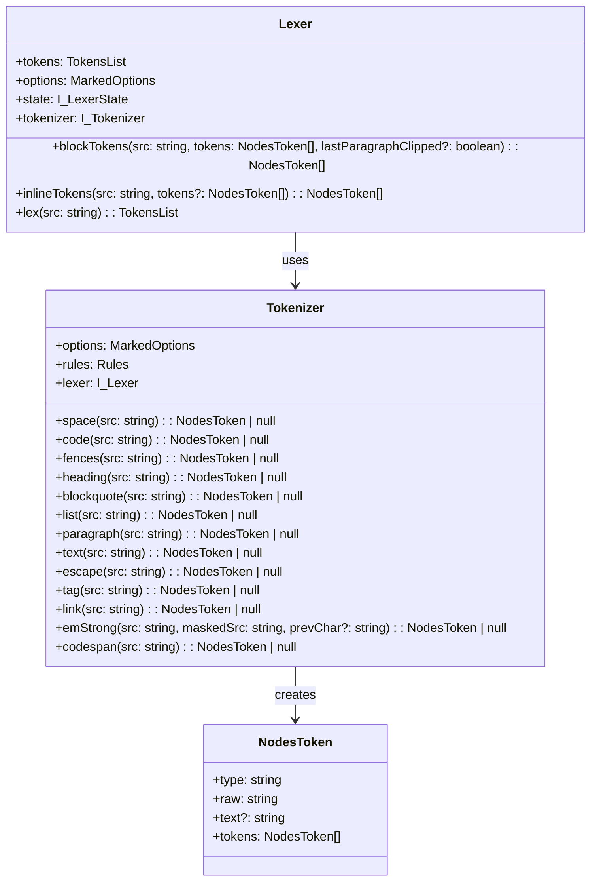

# Markdown扩展架构设计

## 概述

基于现有的kux-marked库中的Lexer和Tokenizer架构，设计扩展支持数学公式方程、mermaid图表、自定义区块等功能的架构方案。该设计旨在保持现有架构的向下兼容性，通过可插拔的扩展机制实现新功能的集成。

## 当前架构分析

### 现有Tokenizer架构


### 扩展点识别

1. **Block级扩展点**：在`Lexer.blockTokens`方法中存在扩展机制
2. **Inline级扩展点**：在`Lexer.inlineTokens`方法中存在扩展机制
3. **自定义Tokenizer方法**：可以在Tokenizer类中添加新的解析方法

## 扩展架构设计

### 扩展接口定义

```typescript
interface TokenizerExtension {
  name: string
  level: 'block' | 'inline'
  priority: number
  tokenizer: (lexer: I_Lexer, src: string, tokens: NodesToken[]) => NodesToken | null
}

interface ExtensionRule {
  pattern: RegExp
  processor: (match: RegExpExecArray, lexer: I_Lexer) => NodesToken
}
```

### 数学公式扩展

#### 行内数学公式
支持`$formula$`和`\\(formula\\)`语法：

```typescript
const mathInlineExtension: TokenizerExtension = {
  name: 'mathInline',
  level: 'inline',
  priority: 100,
  tokenizer: (lexer: I_Lexer, src: string, tokens: NodesToken[]): NodesToken | null => {
    // 匹配 $...$ 语法
    const dollarMatch = /^\$([^\$\n]+?)\$/.exec(src)
    if (dollarMatch) {
      return {
        type: 'math',
        raw: dollarMatch[0],
        text: dollarMatch[1].trim(),
        display: false,
        mathType: 'inline',
        tokens: [] as NodesToken[]
      } as MathToken
    }
    
    // 匹配 \(...\) 语法
    const parenMatch = /^\\\(([^\\]*?)\\\)/.exec(src)
    if (parenMatch) {
      return {
        type: 'math',
        raw: parenMatch[0],
        text: parenMatch[1].trim(),
        display: false,
        mathType: 'inline',
        tokens: [] as NodesToken[]
      } as MathToken
    }
    
    return null
  }
}
```

#### 块级数学公式
支持`$$formula$$`和`\\[formula\\]`语法：

```typescript
const mathBlockExtension: TokenizerExtension = {
  name: 'mathBlock',
  level: 'block',
  priority: 90,
  tokenizer: (lexer: I_Lexer, src: string, tokens: NodesToken[]): NodesToken | null => {
    // 匹配 $$...$$ 语法
    const dollarMatch = /^(\${2,})\n?([\s\S]*?)\n?\1(?:\n|$)/.exec(src)
    if (dollarMatch) {
      return {
        type: 'math',
        raw: dollarMatch[0],
        text: dollarMatch[2].trim(),
        display: true,
        mathType: 'block',
        tokens: [] as NodesToken[]
      } as MathToken
    }
    
    // 匹配 \[...\] 语法
    const bracketMatch = /^\\\[([\s\S]*?)\\\](?:\n|$)/.exec(src)
    if (bracketMatch) {
      return {
        type: 'math',
        raw: bracketMatch[0],
        text: bracketMatch[1].trim(),
        display: true,
        mathType: 'block',
        tokens: [] as NodesToken[]
      } as MathToken
    }
    
    return null
  }
}
```

### Mermaid图表扩展

```typescript
const mermaidExtension: TokenizerExtension = {
  name: 'mermaid',
  level: 'block',
  priority: 80,
  tokenizer: (lexer: I_Lexer, src: string, tokens: NodesToken[]): NodesToken | null => {
    // 匹配 ```mermaid 代码块
    const mermaidMatch = /^```mermaid\n([\s\S]*?)\n```(?:\n|$)/.exec(src)
    if (mermaidMatch) {
      return {
        type: 'mermaid',
        raw: mermaidMatch[0],
        text: mermaidMatch[1].trim(),
        lang: 'mermaid',
        diagramType: detectMermaidType(mermaidMatch[1]),
        tokens: [] as NodesToken[]
      } as MermaidToken
    }
    
    return null
  }
}

function detectMermaidType(content: string): string {
  const firstLine = content.split('\n')[0].trim()
  if (firstLine.startsWith('graph') || firstLine.startsWith('flowchart')) return 'flowchart'
  if (firstLine.startsWith('sequenceDiagram')) return 'sequence'
  if (firstLine.startsWith('classDiagram')) return 'class'
  if (firstLine.startsWith('gantt')) return 'gantt'
  if (firstLine.startsWith('pie')) return 'pie'
  return 'unknown'
}
```

### 自定义区块扩展

#### 警告/提示框
支持GitHub风格的警告框：

```typescript
const alertExtension: TokenizerExtension = {
  name: 'alert',
  level: 'block', 
  priority: 70,
  tokenizer: (lexer: I_Lexer, src: string, tokens: NodesToken[]): NodesToken | null => {
    // 匹配 > [!TYPE] 语法
    const alertMatch = /^> \[!(NOTE|TIP|IMPORTANT|WARNING|CAUTION)\]\n((?:> .*\n?)*)/i.exec(src)
    if (alertMatch) {
      const alertType = alertMatch[1].toLowerCase()
      const content = alertMatch[2].replace(/^> /gm, '').trim()
      
      return {
        type: 'alert',
        raw: alertMatch[0],
        text: content,
        alertType: alertType,
        tokens: lexer.blockTokens(content, [], null)
      } as AlertToken
    }
    
    return null
  }
}
```

#### 容器区块
支持自定义容器语法：

```typescript
const containerExtension: TokenizerExtension = {
  name: 'container',
  level: 'block',
  priority: 60,
  tokenizer: (lexer: I_Lexer, src: string, tokens: NodesToken[]): NodesToken | null => {
    // 匹配 ::: type 语法
    const containerMatch = /^:::\s*(\w+)(?:\s+(.*))?(?:\n([\s\S]*?))?\n:::(?:\n|$)/.exec(src)
    if (containerMatch) {
      const containerType = containerMatch[1]
      const title = containerMatch[2] || ''
      const content = containerMatch[3] || ''
      
      return {
        type: 'container',
        raw: containerMatch[0],
        text: content.trim(),
        containerType: containerType,
        title: title.trim(),
        tokens: content.trim() ? lexer.blockTokens(content.trim(), [], null) : []
      } as ContainerToken
    }
    
    return null
  }
}
```

## Token类型定义

```typescript
interface MathToken extends NodesToken {
  type: 'math'
  display: boolean
  mathType: 'inline' | 'block'
}

interface MermaidToken extends NodesToken {
  type: 'mermaid'
  lang: 'mermaid'
  diagramType: string
}

interface AlertToken extends NodesToken {
  type: 'alert'
  alertType: 'note' | 'tip' | 'important' | 'warning' | 'caution'
}

interface ContainerToken extends NodesToken {
  type: 'container'
  containerType: string
  title: string
}
```

## 扩展集成机制

### 扩展注册器

```typescript
class ExtensionRegistry {
  private blockExtensions: TokenizerExtension[] = []
  private inlineExtensions: TokenizerExtension[] = []
  
  register(extension: TokenizerExtension): void {
    if (extension.level === 'block') {
      this.blockExtensions.push(extension)
      this.blockExtensions.sort((a, b) => b.priority - a.priority)
    } else {
      this.inlineExtensions.push(extension)
      this.inlineExtensions.sort((a, b) => b.priority - a.priority)
    }
  }
  
  getBlockExtensions(): TokenizerExtension[] {
    return this.blockExtensions
  }
  
  getInlineExtensions(): TokenizerExtension[] {
    return this.inlineExtensions
  }
}
```

### Lexer扩展集成

在现有Lexer的`blockTokens`和`inlineTokens`方法中集成扩展机制：

```typescript
// 在blockTokens方法中，现有扩展处理部分的增强
if (this.options.extensions?.block?.some((extTokenizer) => {
  token = extTokenizer({ lexer: this._instance() } as TokenizerThis, src, tokens!)
  if (token != null) {
    if (this._getTokenRaw(token!).length <= src.length) {
      src = src.substring(this._getTokenRaw(token!).length)
    } else {
      src = ''
    }
    this._pushTokens(tokens, token!)
    return true
  }
  return false
}) == true) {
  continue
}
```

### Tokenizer扩展方法

在Tokenizer类中添加扩展处理方法：

```typescript
// 在Tokenizer类中添加
math(src: string): NodesToken | null {
  // 处理数学公式的统一入口
  return mathInlineExtension.tokenizer(this.lexer!, src, [])
}

mermaid(src: string): NodesToken | null {
  // 处理mermaid图表
  return mermaidExtension.tokenizer(this.lexer!, src, [])
}

alert(src: string): NodesToken | null {
  // 处理警告框
  return alertExtension.tokenizer(this.lexer!, src, [])
}

container(src: string): NodesToken | null {
  // 处理自定义容器
  return containerExtension.tokenizer(this.lexer!, src, [])
}
```

## 使用示例

### 扩展注册和使用

```typescript
// 创建扩展注册器
const registry = new ExtensionRegistry()

// 注册扩展
registry.register(mathInlineExtension)
registry.register(mathBlockExtension)
registry.register(mermaidExtension)
registry.register(alertExtension)
registry.register(containerExtension)

// 配置Lexer选项
const options: MarkedOptions = {
  gfm: true,
  breaks: false,
  extensions: {
    block: registry.getBlockExtensions().map(ext => ext.tokenizer),
    inline: registry.getInlineExtensions().map(ext => ext.tokenizer)
  }
}

// 使用扩展的Lexer
const lexer = new Lexer(options)
const tokens = lexer.lex(markdownText)
```

### 流式处理支持

扩展应当支持流式解析场景：

```typescript
interface StreamingExtension extends TokenizerExtension {
  canStartStreaming: (src: string) => boolean
  processStreamingChunk: (chunk: string, context: StreamingContext) => NodesToken | null
}

interface StreamingContext {
  accumulated: string
  isComplete: boolean
  tokenId: string
}
```

## 性能考虑

1. **优先级排序**：按优先级排序扩展，常用扩展优先匹配
2. **正则表达式优化**：使用高效的正则表达式模式
3. **延迟解析**：对于复杂的扩展（如mermaid），可以延迟到渲染时处理
4. **缓存机制**：对解析结果进行缓存，避免重复计算

## 测试策略

### 单元测试
```typescript
describe('Math Extension', () => {
  it('should parse inline math with dollar syntax', () => {
    const src = '$E=mc^2$'
    const token = mathInlineExtension.tokenizer(mockLexer, src, [])
    expect(token).toBeDefined()
    expect(token?.type).toBe('math')
    expect(token?.display).toBe(false)
    expect(token?.text).toBe('E=mc^2')
  })
  
  it('should parse block math with double dollar syntax', () => {
    const src = '$$\\int_{-\\infty}^{\\infty} e^{-x^2} dx = \\sqrt{\\pi}$$'
    const token = mathBlockExtension.tokenizer(mockLexer, src, [])
    expect(token).toBeDefined()
    expect(token?.type).toBe('math')
    expect(token?.display).toBe(true)
  })
})
```

### 集成测试
```typescript
describe('Extension Integration', () => {
  it('should handle mixed content with multiple extensions', () => {
    const markdown = `
# 标题

这是一个数学公式：$E=mc^2$

\`\`\`mermaid
graph TD
  A --> B
\`\`\`

> [!WARNING]
> 这是一个警告框

::: tip 提示
这是一个提示容器
:::
`
    const tokens = lexer.lex(markdown)
    // 验证各种扩展token都被正确解析
  })
})
```