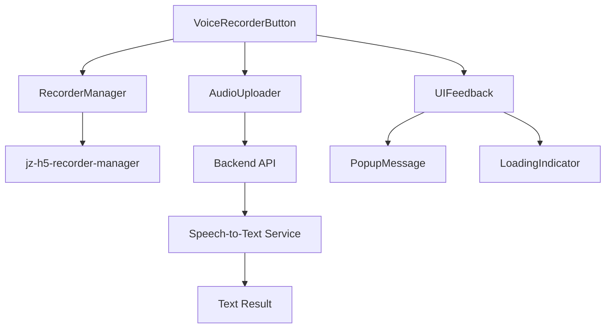
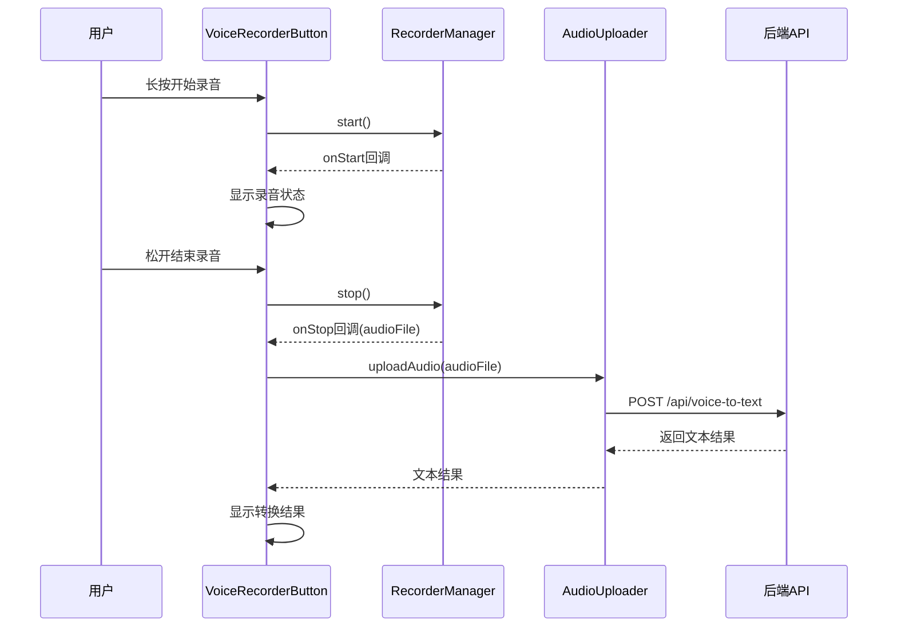

# 语音录制转文本功能集成设计文档

## 概述

基于 `jz-h5-recorder-manager` 插件在 uni-app 小程序中实现语音录制转文本功能。用户通过长按按钮开始录音，松开后停止录音并调用后端接口进行语音转文本处理。

## 技术栈与依赖

### 项目框架
- **框架**: uni-app x (基于Vue.js)
- **开发语言**: 
  - **UTS**: TypeScript的超集，用于原生插件开发
  - **uvue**: Vue的uni-app x版本，用于页面和组件开发
- **插件管理**: uni_modules 方式
  - 所有插件安装在 uni_modules 目录下
  - 插件通过 uni_modules 方式进行安装、管理和使用
  - 支持插件的独立版本控制和更新
  - 提供统一的插件安装、配置和使用方式

### 新增依赖
- `jz-h5-recorder-manager`: H5录音管理器插件，兼容uni-app x全平台
  - 安装方式: 安装在 uni_modules 目录下
  - 开发语言: UTS (插件层) + uvue (组件层)
  - 音频格式: MP3 (默认)
  - 跨平台支持: H5、App、小程序
- 文件上传: FormData + 后端接口

### 现有技术栈
- 框架: uni-app x
- 开发语言: UTS + uvue (Vue的uni-app x版本)
- 插件系统: uni_modules 管理
- 事件流: @microsoft/fetch-event-source
- UI组件: uni-popup, uni-icons 等 (通过 uni_modules 引入)

## 架构设计

### 组件架构



### 数据流架构



## 核心组件设计

### VoiceRecorderButton 组件

```typescript
interface VoiceRecorderProps {
  // 录音配置
  duration?: number;        // 最大录音时长 (ms)
  format?: 'mp3' | 'wav';  // 音频格式
  sampleRate?: number;      // 采样率
  
  // UI配置
  buttonText?: string;      // 按钮文字
  buttonSize?: string;      // 按钮尺寸
  showWaveform?: boolean;   // 显示波形动画
  
  // 事件回调
  onRecordStart?: () => void;
  onRecordStop?: (result: string) => void;
  onError?: (error: Error) => void;
}

interface RecordState {
  isRecording: boolean;
  isPressing: boolean;
  recordDuration: number;
  audioFile?: string;
  transcriptResult?: string;
  isUploading: boolean;
}
```

### 录音管理器封装

```typescript
class VoiceRecorderManager {
  private recorderManager: any;
  private state: RecordState;
  
  constructor(config: RecorderConfig) {
    // 初始化录音管理器
    this.recorderManager = jzRecorder.getRecorderManager();
    this.setupEventListeners();
  }
  
  // 开始录音
  startRecording(): Promise<void>
  
  // 停止录音
  stopRecording(): Promise<AudioFile>
  
  // 事件监听器设置
  private setupEventListeners(): void
}

interface AudioFile {
  tempFilePath: string;
  duration: number;
  fileSize: number;
  format: string;
}
```

### 音频上传器

```typescript
class AudioUploader {
  // 上传音频文件
  async uploadAudio(audioFile: AudioFile): Promise<TranscriptResult> {
    const formData = new FormData();
    formData.append('audio', audioFile);
    formData.append('format', audioFile.format);
    formData.append('duration', audioFile.duration.toString());
    
    const response = await uni.request({
      url: '/api/voice-to-text',
      method: 'POST',
      data: formData,
      header: {
        'Content-Type': 'multipart/form-data'
      }
    });
    
    return response.data;
  }
}

interface TranscriptResult {
  success: boolean;
  text: string;
  confidence: number;
  duration: number;
  error?: string;
}
```

## UI设计规范

### 录音按钮状态

| 状态 | 视觉效果 | 交互行为 |
|------|----------|----------|
| 默认 | 灰色圆形按钮，麦克风图标 | 可点击，显示"长按录音" |
| 按下 | 红色按钮，放大效果 | 触发haptic反馈 |
| 录音中 | 红色按钮，波形动画 | 显示录音时长 |
| 上传中 | 蓝色按钮，loading动画 | 禁用交互 |
| 完成 | 绿色按钮，检查图标 | 显示转换结果 |
| 错误 | 红色按钮，错误图标 | 显示错误信息 |

### 波形动画设计


## API接口设计

### 语音转文本接口

```typescript
// 请求接口
POST /api/voice-to-text

// 请求参数
Content-Type: multipart/form-data
{
  audio: File,           // 音频文件
  format: string,        // 音频格式 (mp3/wav)
  duration: number,      // 录音时长(秒)
  userId?: string,       // 用户ID (可选)
  language?: string      // 语言类型 (默认中文)
}

// 响应格式
{
  success: boolean,
  data: {
    text: string,        // 转换后的文本
    confidence: number,  // 识别置信度 (0-1)
    duration: number,    // 音频时长
    segments?: Array<{   // 分段结果 (可选)
      text: string,
      start: number,
      end: number,
      confidence: number
    }>
  },
  error?: {
    code: string,
    message: string
  }
}
```

### 后端接口实现 (模拟)

```typescript
// 暂时模拟实现
async function mockVoiceToText(audioFile: File): Promise<TranscriptResult> {
  // 模拟处理延迟
  await new Promise(resolve => setTimeout(resolve, 2000));
  
  // 模拟识别结果
  const mockTexts = [
    "这是一段测试语音转文本的内容",
    "语音识别功能正在正常工作",
    "请检查录音质量是否清晰"
  ];
  
  return {
    success: true,
    text: mockTexts[Math.floor(Math.random() * mockTexts.length)],
    confidence: 0.85 + Math.random() * 0.15,
    duration: audioFile.duration
  };
}
```

## 错误处理机制

### 录音错误类型

| 错误类型 | 错误代码 | 处理方案 |
|----------|----------|----------|
| 权限拒绝 | PERMISSION_DENIED | 引导用户开启麦克风权限 |
| 设备不支持 | DEVICE_NOT_SUPPORTED | 提示使用支持的设备 |
| 录音时长过短 | DURATION_TOO_SHORT | 提示最少录音时长 |
| 录音时长过长 | DURATION_TOO_LONG | 自动停止并处理 |
| 网络错误 | NETWORK_ERROR | 重试机制或离线提示 |
| 上传失败 | UPLOAD_FAILED | 重试上传或本地保存 |

### 错误恢复策略

```typescript
class ErrorHandler {
  async handleRecordingError(error: RecordingError): Promise<void> {
    switch (error.code) {
      case 'PERMISSION_DENIED':
        await this.showPermissionGuide();
        break;
      case 'NETWORK_ERROR':
        await this.retryWithBackoff();
        break;
      case 'UPLOAD_FAILED':
        await this.saveForRetry();
        break;
      default:
        await this.showGenericError(error.message);
    }
  }
  
  private async retryWithBackoff(): Promise<void> {
    // 指数退避重试策略
  }
}
```

## 性能优化策略

### 音频文件优化
- 采用MP3格式压缩音频文件大小
- 设置合适的采样率 (16kHz) 平衡质量与大小
- 限制录音时长避免文件过大

### 上传优化
- 实现分片上传大文件
- 添加上传进度显示
- 支持断点续传

### 内存管理
```typescript
class MemoryManager {
  // 及时清理音频文件
  cleanupAudioFile(filePath: string): void {
    try {
      uni.removeSavedFile({ filePath });
    } catch (error) {
      console.warn('清理音频文件失败:', error);
    }
  }
  
  // 限制同时存在的音频文件数量
  limitConcurrentFiles(): void {
    // 最多保留3个录音文件
  }
}
```

## 测试策略

### 单元测试

```typescript
describe('VoiceRecorderManager', () => {
  test('应该能够开始录音', async () => {
    const recorder = new VoiceRecorderManager(defaultConfig);
    await recorder.startRecording();
    expect(recorder.isRecording).toBe(true);
  });
  
  test('应该能够停止录音并返回音频文件', async () => {
    const recorder = new VoiceRecorderManager(defaultConfig);
    await recorder.startRecording();
    const audioFile = await recorder.stopRecording();
    expect(audioFile.tempFilePath).toBeDefined();
  });
});

describe('AudioUploader', () => {
  test('应该能够上传音频文件并返回文本结果', async () => {
    const uploader = new AudioUploader();
    const mockAudioFile = createMockAudioFile();
    const result = await uploader.uploadAudio(mockAudioFile);
    expect(result.success).toBe(true);
    expect(result.text).toBeDefined();
  });
});
```

### 集成测试场景
1. 完整录音流程测试
2. 网络异常情况测试
3. 权限拒绝场景测试
4. 长时间录音测试
5. 多次连续录音测试

### 用户体验测试
- 不同设备的兼容性测试
- 不同网络环境下的性能测试
- 录音质量与识别准确率测试