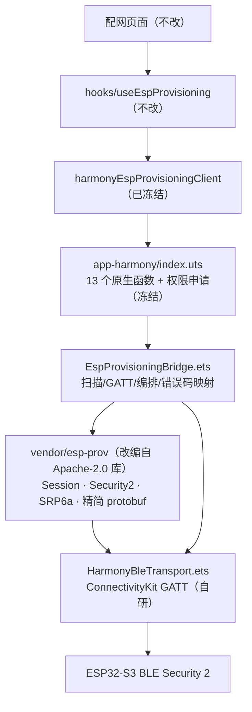

# HarmonyOS ESP 配网 · esp-idf-provisioning-harmony 集成方案

> 分支：`feat/nuwa-zhuoda-2026.07-esp-harmony`（2026-08-19 集成完成）
> 目标运行时：纯血 HarmonyOS NEXT 6.0 / API 20 / DevEco 5.x（无 AOSP，禁 APK/AAR/JNI）
> 关联：[harmony-esp-provisioning-local-base.md](./harmony-esp-provisioning-local-base.md)（基座侧） · [esp-provisioning-local-base.md](./esp-provisioning-local-base.md)（总览） · 契约 [docs/ble/esp32s3-idf6-provisioning-contract.json](../ble/esp32s3-idf6-provisioning-contract.json)

## 1. 背景与决策

鸿蒙端需要与 Android/iOS 同签名的 ESP32 BLE + Security 2 配网实现。Security 2（SRP6a + AES-256-GCM）原计划从零手写；评估三方库
[esp-idf-provisioning-harmony](https://gitcode.com/Z_Heart/esp-idf-provisioning-harmony)（Apache-2.0，OHPM `esp-idf-provisioning-harmony@1.0.1`，commit `0956281b`，2026-03-07）后，改为**以该库为协议参考做源码内置**。

| 决策点 | 选择 | 理由 |
|---|---|---|
| 集成方式 | 源码内置（vendor），不用 OHPM registry 依赖 | registry 版无法打补丁：上游 `ESPDevice.initSession` 明文打印 PoP、SRP 私钥用 `Math.random()` |
| 内置范围 | **只取协议核心**（Security2/Session/SRP6a/精简 protobuf），不取 FastBLE 传输层与 10.9k 行生成 proto | 免掉 `@ohos/fastble`、`@hadss/turbo-trans-protobuf`、`@ohos/protobufjs` 三个 ohpm 依赖；BLE 复用本插件已验证的 ConnectivityKit 实现 |
| 哈希实现 | `@kit.CryptoArchitectureKit` SHA-512（上游用 `@ohos/crypto-js`） | 再省一个依赖；AES-GCM/CSPRNG 同 Kit |
| 结果 | `config.json` 仅 `minApiLevel: 20`，**零三方依赖** | 供应链面最小；自定义基座构建无需 ohpm 拉包 |

## 2. 协议可信度核验（对照乐鑫官方源码）

逐条比对 [espressif/esp-idf-provisioning-android](https://github.com/espressif/esp-idf-provisioning-android) 与 esp-idf `components/protocomm/proto/*`：

| 协议点 | 官方实现 | 本仓实现 | 结论 |
|---|---|---|---|
| 加密数据帧 | `Security2.encrypt` 裸返回 ciphertext‖tag，**无** protobuf 包裹（无 Sess2Msg） | 相同 | ✅ |
| GCM nonce | deviceNonce[0..7] + BE(counter)，**单一共享 counter**，enc/dec 都递增（仅 `sec_patch_ver==1` 时；否则 nonce 即 deviceNonce） | 相同 | ✅ |
| 会话密钥 | H(S) 大端字节取前 32 字节作 AES-256 key | 相同 | ✅ |
| SRP 参数 | RFC5054 **3072-bit 组、g=5、SHA-512**；x = H(s, H(I ":" P))；M1/M2 标准公式 | 相同（BigInt 实现） | ✅ |
| protobuf 字段号 | `SessionData.sec_ver` = **字段 2**（非 1）、oneof sec0/sec1/sec2 = 10/11/12；`Sec2Payload.msg` = 1、oneof sc0/sr0/sc1/sr1 = 20/21/22/23；scan/config 各消息字段 | `EspProto.ets` 逐一比对 | ✅ |
| 会话流程 | `prov-session` 上 `getNextRequestInSession` 循环；握手后 encrypt → 裸发 → decrypt | 相同 | ✅ |
| proto-ver | 明文发 `ESP`，返回 JSON（prov.ver/sec_ver/cap、nuwax.ver） | 相同 | ✅ |

## 3. 架构与文件地图



```text
uni_modules/nuwax-esp-provisioning/utssdk/app-harmony/
├── index.uts                     # 13 个原生函数（签名与 app-android/app-ios 对齐；@UTSJS.keepAlive；abilityAccessCtrl 申请 ACCESS_BLUETOOTH）
├── EspProvisioningBridge.ets     # 适配器：扫描 / GATT 连接 / proto-ver / Sec2 编排 / Wi-Fi 扫描与配网 / 错误码与进度码映射
├── config.json                   # minApiLevel 20，无三方依赖
├── module.json5                  # ohos.permission.ACCESS_BLUETOOTH
├── resources/base/element/string.json
└── vendor/esp-prov/              # 改编自 esp-idf-provisioning-harmony（出处/补丁见 NOTICE.txt、LICENSE）
    ├── HarmonyBleTransport.ets   # 自研 GATT 运输层（0x2901 endpoint 寻址 / MTU 分片 / notify 重组 / read 回退）
    ├── Session.ets               # 会话状态机 + Transport/SessionListener 接口定义
    ├── proto/EspProto.ets        # 精简 protobuf 编解码（Sec2 握手 + wifi scan/config）+ protobufFrameComplete + UTF-8 工具
    ├── security/Security2.ets    # SRP6a 会话 + AES-256-GCM（cryptoFramework，含 nonce/counter）
    └── srp6a/                    # SRP6a 四件套：ClientSession / Routines / CryptoParams / BigIntegerUtils（BigInt）
```

调用链与 Android/iOS 完全一致：

```text
扫码/扫描 → connect(BLE+Sec2) → proto-ver
→ device-info → bind + vox-config（Wi-Fi 之前）
→ 可选 wifi_scan → set/apply → get_status 轮询 → GOT_IP
```

## 4. 相对上游库的补丁

| # | 补丁 | 原因 |
|---|---|---|
| 1 | 删除 `POP: ` 明文日志（上游 ESPDevice.initSession） | 验收契约：日志不打 PoP / Wi-Fi 密码 / deviceSecret；本仓 vendor 内零 console 输出 |
| 2 | SRP 私钥 `a` 用 `cryptoFramework.createRandom().generateRandomSync(32)`（上游 Math.random） | 加密安全随机 |
| 3 | SHA-512 用 cryptoFramework（上游 @ohos/crypto-js） | 免 ohpm 依赖 |
| 4 | protobuf 用 436 行手写精简编解码（上游 10.9k 行生成代码 + turbo-trans-protobuf） | 免 ohpm 依赖；字段号经官方 proto 核验 |
| 5 | BLE 传输层自研 ConnectivityKit（上游 FastBLE），含 MTU 分片与 notify 重组 | 免 ohpm 依赖；上游单包写模型在低 MTU 下会截断，本仓已补齐 |
| 6 | **强制 Security 2**：`proto-ver.sec_ver != 2` → `SECURITY_MISMATCH`（上游会自动降级 sec1） | 契约：Security 2 不降级 |
| 7 | UTF-8 全链路标准实现（含 4 字节代理对），上游 TextEncoder 之外的字符串路径逐字节截断问题已消除 | 中文 SSID / emoji 密码正确性 |

## 5. 冻结的业务接口（验收红线）

**不改**：`hooks/useEspProvisioning.uts`、`utils/provisioning/espProvisioningClient.uts`、
`utils/provisioning/harmonyEspProvisioningClient.uts`、插件 `interface.uts`、配网页面、`App.uvue` 注册、
Android/iOS 两端、契约 JSON。`index.uts` 的 13 个函数签名与两端对齐：
`ensureNativeEspPermissions` / `initializeNativeEspProvisioning` / `setNativeEspLog` /
`startNativeEspScan` / `stopNativeEspScan` / `connectNativeEspDevice` / `getNativeEspCapabilities` /
`getNativeEspDeviceInfo` / `sendNativeEspCustomData` / `scanNativeEspNetworks` /
`provisionNativeEspDevice` / `disconnectNativeEspDevice` / `disposeNativeEspProvisioning`。

### 5.1 行为映射（与 app-android/EspProvisioningBridge.kt 同表）

| 函数 | 鸿蒙实现 |
|---|---|
| startNativeEspScan | `ble.startBLEScan` 连续扫描（OHOS 无 Android 6s 窗口限制，无需窗口重启）；广播名 `prefix` 前缀或 serviceUuid 命中即去重回调；`BLUETOOTH_OFF` / `SCAN_FAILED` |
| connectNativeEspDevice | GATT connect → **MTU 512** → 0x2901 endpoint 映射 → proto-ver → `sec_ver==2` 校验 → Security 2 握手 → 成功回调；整体受 `timeoutMs` 约束（默认 25s，超时 `CONNECT_FAILED`）；断开 `DISCONNECTED` |
| getNativeEspCapabilities | proto-ver JSON → `{"appVersion": nuwax.ver, "protocolVersion": prov.ver, "securityVersion": prov.sec_ver, "capabilities": [...]}`（字符串均已 JSON 转义） |
| getNativeEspDeviceInfo | `device-info` 发 `{}`，返回固件 JSON；稳定身份 = `serialNumber`（BLE deviceId 每轮扫描可变，仅作句柄） |
| sendNativeEspCustomData | `vox-config` 等自定义 endpoint，走已加密会话；payload/响应 UTF-8 |
| scanNativeEspNetworks | prov-scan：start → 1.5s 轮询（≤15 次）→ 4 条/批拉取 → `[{"ssid","rssi","security"}]`；失败 `UNKNOWN` |
| provisionNativeEspDevice | 见 5.2 / 5.3 |
| disconnect / dispose | 断 GATT、清 transport；dispose 另清扫描与日志回调 |

### 5.2 进度码（progress 回调）

`SENDING_CREDENTIALS`（set 配置已写出）→ `APPLYING_CONFIG` + `CHECKING_STATUS`（apply 已写出）→ `SUCCESS`（GOT_IP）。

### 5.3 错误码

| 场景 | 错误码 |
|---|---|
| 蓝牙未开 | `BLUETOOTH_OFF` |
| 扫描启动失败 | `SCAN_FAILED` |
| 连接/握手超时 | `CONNECT_FAILED` |
| GATT 断开 | `DISCONNECTED` |
| 固件 sec_ver ≠ 2 | `SECURITY_MISMATCH` |
| 凭证/会话类失败（mismatch/proof/mitm/session/credential/auth） | `SECURITY_AUTH_FAILED` |
| 其余会话失败 | `SESSION_FAILED` |
| set 配置写出失败 | `SEND_CONFIG_FAILED` |
| apply 写出失败 | `APPLY_CONFIG_FAILED` |
| 设备报 Wi-Fi 鉴权失败 | `WIFI_AUTH_FAILED` |
| 设备报网络未找到 | `NETWORK_NOT_FOUND` |
| 状态轮询超时 | `STATUS_TIMEOUT` |
| 其余 | `UNKNOWN` |

## 6. BLE 传输层细节（HarmonyBleTransport）

- **endpoint 寻址**：GATT 发现后按 Characteristic `0x2901` User Description 映射名称（`prov-session`/`proto-ver`/`prov-scan`/`prov-config`/`device-info`/`vox-config`…），不硬编码 FF01～FF05；描述符值缺失时用 GATT 读兜底（读前 80ms 稳定等待，规避 2900011 设备忙）
- **MTU**：连接后请求 512，监听 `BLEMtuChange` 记录实际协商值；协商失败回退 23
- **写方向**：按 `MTU-3` 分片顺序写（≥20ms 间隔），对齐官方 Android SplitWriter 行为，固件按序拼装（Security 2 `Cmd0` 请求约 420B）
- **读方向**：每个 endpoint 预订阅 notify；响应累积重组——收到分片后先做 **protobuf 帧完整判定**（`EspProto.protobufFrameComplete`：全部字段恰好消费完即完整），未收齐继续等；250ms 静默窗口兜底（兼容 proto-ver 的 JSON 等非 protobuf 响应）。8s 无响应回退 `readCharacteristicValue`
- **串行化**：`sending` 互斥 + 40ms 自旋，避免并发写
- Security 2 `Resp0`（device_pubkey 385B + salt，约 420B）在低 MTU 下依赖重组不截断

## 7. 安全与脱敏

- PoP / Wi-Fi 密码 / deviceSecret 仅内存持有；vendor 内零 console 输出，桥接 `emit` 仅元数据且 deviceId 脱敏为尾 5 位
- SRP 私钥、随机数全部 cryptoFramework CSPRNG
- 强制 Security 2，不降级；`step3` 校验设备证据（M2），不符即抛（MITM 防护）

## 8. 编译验证（可复现）

本机无 HX 鸿蒙发行链路时，用 DevEco 自带 hvigor 做 HAR 模块编译验证（临时工程在 `/tmp/esp-harmony-compile`，可按下述重建）：

```bash
# 1) 骨架：任一标准 DevEco 工程的 AppScope/ + 根 build-profile.json5（products: compatibleSdkVersion 5.1.0(18)、targetSdkVersion 6.0.2(22)）
#    根 hvigorfile.ts 用 appTasks；library/hvigorfile.ts 用 harTasks；library oh-package 声明 main: ./src/main/ets/Index.ets
# 2) 源码：拷贝 app-harmony/{EspProvisioningBridge.ets, vendor/} 到 library/src/main/ets/（index.uts 是 UTS，不参与 hvigor）
# 3) 编译：
export DEVECO_SDK_HOME=/Applications/DevEco-Studio.app/Contents/sdk
export PATH=/Applications/DevEco-Studio.app/Contents/tools/node:/Applications/DevEco-Studio.app/Contents/tools/hvigor/bin:$PATH
hvigorw --mode module -p module=library@default -p product=default -p buildMode=debug assembleHar --no-daemon
# 期望：BUILD SUCCESSFUL，零 error；警告为权限提示（真实插件 module.json5 已声明 ACCESS_BLUETOOTH）
```

已踩过的 ArkTS 坑（改 vendor 时注意）：

- `throw e` 必须写 `throw e as Error`（arkts-limited-throw）
- SDK class 不能 `as Record<string, Object>`（如 ble.ScanResult，且其本无 deviceName 字段）
- BigInt、元组返回值在此编译层级可用
- **UTS 层（index.uts）不在本 harness 覆盖内**：OHOS Promise 的回调参数须用真实 SDK 类型（如 `requestPermissionsFromUser().then((data: PermissionRequestResult))`），不能想当然写 `UTSJSONObject`；HX 会把 index.uts 转换到 dist 的同名 index.ets 再编译。真机运行前的完整验证 = HX「运行到鸿蒙」或对 `unpackage/dist/dev/app-harmony` 跑 `hvigorw --mode module -p module=uni_modules__nuwax_esp_provisioning@default assembleHar`（**勿在 HX 正在跑编译时执行**，会争抢产物目录）

## 9. 验证状态与真机验收清单

| 项 | 状态 |
|---|---|
| 协议核验（字段号/算法/流程 vs 官方源码） | ✅ 本文 §2 |
| ArkTS 编译（DevEco hvigor，HAR 模块） | ✅ 零 error：隔离 harness + HX 产物工程插件模块双验证（含 UTS 转换层 PermissionRequestResult 修复后复验） |
| 脱敏审计 | ✅ grep 审计通过（无 PoP/密码/deviceSecret 输出路径） |
| Android/iOS 回归 | 无共享文件改动，签名层零影响 |
| 纯血 HarmonyOS 6 真机全流程 | ⏳ 待设备 |

真机验收清单（设备到位后执行，对应原计划 todo `harmony-device-verify`）：

1. 权限：首次进入配网页，NEXT 弹窗申请 `ACCESS_BLUETOOTH`（拒绝 → `NO_PERMISSION`，可重试）
2. 扫描：扫出 `PROV_*` 设备（含名称/RSSI）；扫码入口直接带参连接
3. 连接：MTU 协商日志、endpoint 列表含 `prov-session`/`proto-ver`/`device-info`/`vox-config`；Sec2 握手完成（`sec2_established`）
4. device-info：返回 JSON，取 `serialNumber` 作稳定身份；vox-config 下发成功（服务器侧可见绑定）
5. Wi-Fi 扫描：列表含**中文 SSID**（UTF-8 验证）、rssi/security 正确
6. 配网：错误密码 → `WIFI_AUTH_FAILED`；不存在的 SSID → `NETWORK_NOT_FOUND`；正确凭证 → `SENDING_CREDENTIALS`→`APPLYING_CONFIG`→`CHECKING_STATUS`→`SUCCESS`（GOT_IP），设备上线
7. 断链/重试：配网中断开 BLE 的错误表现记录归档
8. 日志复查：全流程 hilog 无 PoP/密码/deviceSecret
9. 自定义基座：确认 HAP 基座含本插件与蓝牙权限（必要时重打 HarmonyOS 6 HAP 基座，见 local-base 文档）
10. Android/iOS 同版本回归一遍同流程

已知风险（真机关注）：

- notify 重组静默窗口 250ms：极端慢设备如出现响应截断，调大 `NOTIFY_QUIET_MS`
- `BLEMtuChange` 不回报时回退 20B/包分片，握手变慢但可用
- 设备连上 Wi-Fi 后即断 BLE 是常态：若最后一次 get_status 未赶上会报 `SESSION_FAILED`/`UNKNOWN`（与官方 Android SDK 行为一致），按真机时序决定是否加宽限轮询
- provision 状态轮询步长 2s、上限 `timeoutMs`（默认 35s）

## 10. 维护注意

- **改 vendor 或桥接的任何 .ets 后，必须重跑 §8 编译验证**——当前没有其他编译路径覆盖这些文件
- 升级上游库：重新对照 GitCode 仓库 diff，逐补丁重放（§4 表即补丁清单）；不要整目录覆盖
- 禁止：向 config.json 引入 ohpm 依赖、恢复 sec1 降级、修改 13 函数签名与业务接入层
- 设备身份相关逻辑（serialNumber vs BLE deviceId）见 §5.1 与 local-base 文档「验收注意」
