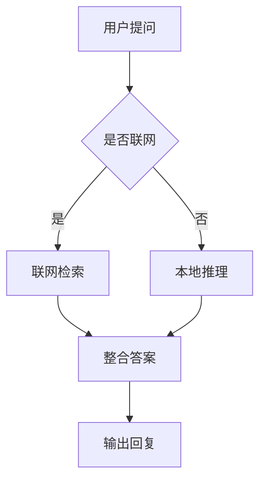

# Markdown 渲染验收样本

## 一、行内排版与基础块级

正文里可以有 **加粗**、*斜体*、~~删除线~~ 与 `行内代码`。也可以混入行内公式，比如能量 $E=mc^2$ 与概率密度 $|\Psi|^2$。

### 列表

- 第一点：无序项，含 $a^2+b^2$
- 第二点：另一个无序项
  - 嵌套子项（cmark 支持嵌套，fallback 当前拍平）

1. 有序项一，含 $n^2$
2. 有序项二

### 引用块

> 这是一段引用。
> 引用内同样支持 **加粗** 与 $x^2$ 公式。
> 多行连续显示为一块。

### 链接与裸 URL

参考 [uni-app x 文档](https://doc.dcloud.net.cn/uni-app-x/)，或直接访问 https://www.dcloud.io 查看官网。

### 水平线（应不渲染）

上文段落

---

下文段落

---

## 二、数学公式

行内公式用美元符 $a^2+b^2=c^2$，也可用 bracket 写法 $f(x)=x^2$，或 \( g(x)=\sin(x) \) 这种圆括号定界符。

块级公式（双美元符）：

$$
\int_{-\infty}^{\infty} e^{-x^2}\,dx = \sqrt{\pi}
$$

跨行块公式（方括号定界，含 aligned 对齐）：

\[
\begin{aligned}
\nabla \times \vec{B} &= \mu_0 \vec{J} + \mu_0\varepsilon_0 \frac{\partial \vec{E}}{\partial t} \\
\nabla \times \vec{E} &= -\frac{\partial \vec{B}}{\partial t}
\end{aligned}
\]

math 代码块：

```math
\zeta(s) = \sum_{n=1}^{\infty} \frac{1}{n^s}
```

超长公式（H5 应横向滚动、不折断）：

$$
\Gamma(s) = \int_{0}^{\infty} x^{s-1} e^{-x}\,dx, \quad \zeta(s) = \sum_{n=1}^{\infty}\frac{1}{n^{s}}, \quad \Phi(x) = \frac{1}{\sqrt{2\pi}}\int_{-\infty}^{x} e^{-t^{2}/2}\,dt, \quad \mathrm{Ei}(x) = -\int_{-x}^{\infty}\frac{e^{-t}}{t}\,dt
$$

多项式（H5 修复前会在加号处折断、出多余空行）：

$$
f(x) = a x^2 + b x + c = a\left(x + \frac{b}{2a}\right)^2 + \left(c - \frac{b^2}{4a}\right)
$$

---

## 三、代码与表格

代码块（App 高亮 / H5 纯文本）：

```javascript
function fib(n) {
  if (n < 2) return n;
  return fib(n - 1) + fib(n - 2);
}
```

```python
def fib(n):
    a, b = 0, 1
    for _ in range(n):
        a, b = b, a + b
    return a
```

行内代码示例：用 `npm install` 安装依赖。

表格（对齐 / 单元格公式 / 空表头剔除）：

| 名称 | 值 $c$ | 说明 |
|:-----|:------:|-----:|
| 速度 $v$ | $10$ | 左对齐 |
| 加速度 $a$ | $9.8$ | 居中 |
| 力 $F$ | $ma$ | 右对齐 |

空表头剔除（首列空表头不应出现空白列）：

| | 值 |
|---|---:|
| 项 A | 1 |
| 项 B | 2 |

---

## 四、Mermaid 图表

正常流程图：



宽图（应自适应容器 / 可横滚，不被压扁）：


语法错误（应回退到代码 Tab，图表 Tab 不空白）：

```mermaid
this is intentionally invalid mermaid syntax !!! @#$%
```

---

## 五、图片

正常图片（原位渲染，点击可预览）：


图片后正文继续。

错误图片（应显示占位图 / 错误提示，而非空白）：


---

## 六、自定义标签（Agent 体系）

工具卡：

<markdown-custom-process executeId="exec-001" type="search" status="done" name="网页搜索" />

工具组（可折叠）：

<markdown-custom-process-group>
<markdown-custom-process executeId="exec-002" type="code_run" status="running" name="运行 Python 脚本" />
<markdown-custom-process executeId="exec-003" type="search" status="pending" name="查找参考资料" />
</markdown-custom-process-group>

历史容器语法：

:::container type="search" executeId="exec-004" name="历史语法容器" status="done"
:::

任务产物卡：

<task-result>
<description>已完成本周（W32）销售数据汇总，共 12 个品类。</description>
<file>sales-report-2026-W32.xlsx</file>
</task-result>

会话链接（点击跳会话详情）：

<conversation id="conv-9f3a2c1b" agentId="agent-biz-report" />
