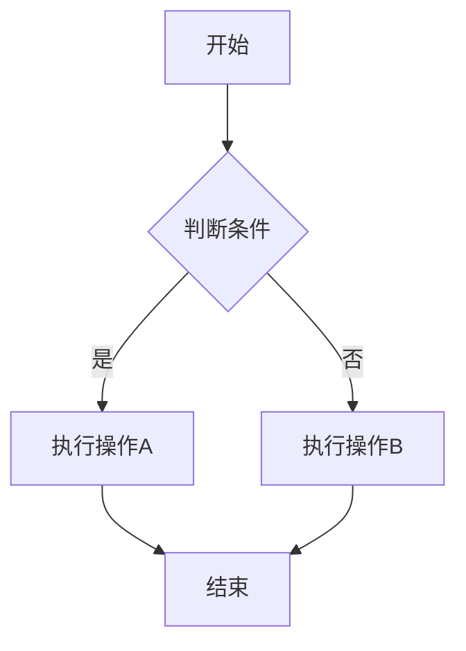
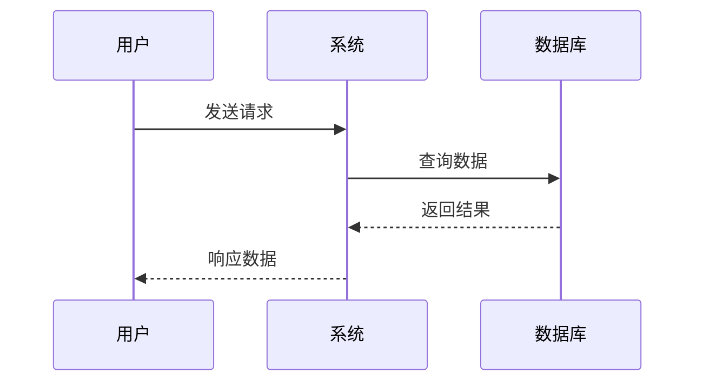
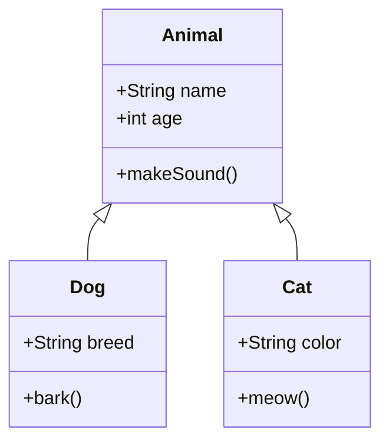
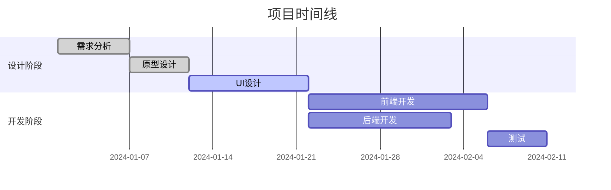
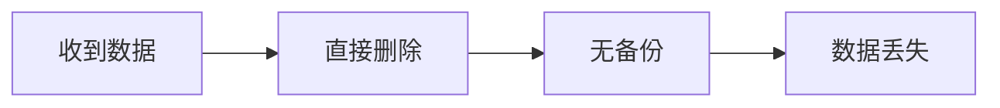

# Markdown扩展功能测试

## 数学公式扩展测试

### 行内数学公式

测试 $E=mc^2$ 和 \(F=ma\) 的数学公式渲染。

包含希腊字母的公式：$\alpha + \beta = \gamma$

### 块级数学公式

这是一个块级数学公式：

$$
\int_{-\infty}^{\infty} e^{-x^2} dx = \sqrt{\pi}
$$

另一种语法：

\[
\frac{d}{dx}\int_a^x f(t)dt = f(x)
\]

复杂的矩阵公式：

$$
\begin{pmatrix}
a & b \\
c & d
\end{pmatrix}
\begin{pmatrix}
x \\
y
\end{pmatrix}
=
\begin{pmatrix}
ax + by \\
cx + dy
\end{pmatrix}
$$

## Mermaid图表扩展测试

### 流程图



### 时序图



### 类图



### 甘特图



## 警告/提示框扩展测试

### Note提示

> [!NOTE]
> 这是一个一般性的注意事项。用于提供重要的信息或说明。

### Tip提示

> [!TIP]
> 这是一个有用的提示。可以包含最佳实践或建议。

### Important重要信息

> [!IMPORTANT]
> 这是非常重要的信息。需要特别注意的内容。

### Warning警告

> [!WARNING]
> 这是一个警告信息。提醒用户注意潜在的问题。

### Caution小心

> [!CAUTION]
> 这是一个需要小心处理的情况。可能会有风险。

## 容器区块扩展测试

### 提示容器

::: tip 优化建议
这是一个提示容器，用于展示有用的建议和技巧。
可以包含多行内容和**格式化文本**。
:::

### 警告容器

::: warning 注意事项
这是一个警告容器，用于提醒用户注意重要事项。
- 项目1
- 项目2
- 项目3
:::

### 危险容器

::: danger 危险操作
这是一个危险警告容器。用于标记可能导致数据丢失或系统损坏的操作。

```bash
rm -rf /
```

**请勿执行上述命令！**
:::

### 信息容器

::: info 相关信息
这是一个信息容器，用于提供额外的背景信息或说明。

支持各种内容类型：
1. 有序列表
2. `代码片段`
3. [链接](https://example.com)
:::

### 详情容器

::: details 点击查看详情
这是一个可折叠的详情容器。

包含详细的技术信息：

- 技术栈：Vue.js + TypeScript
- 构建工具：Vite
- 测试框架：Jest
- 部署平台：Vercel

```javascript
function example() {
    return "Hello World";
}
```
:::

### 引用容器

::: quote 名人名言
"代码是写给人看的，顺便能在计算机上运行。"
— 哈尔·阿贝尔森
:::

## 混合使用测试

### 在容器中使用数学公式

::: tip 数学公式说明
欧拉公式是数学中最美丽的公式之一：

$$e^{i\pi} + 1 = 0$$

这个公式将数学中的五个重要常数联系在一起：
- $e$（自然对数的底）
- $i$（虚数单位）
- $\pi$（圆周率）
- $1$（自然数的单位）
- $0$（加法的单位元）
:::

### 在警告框中使用Mermaid图表

> [!WARNING]
> 以下流程图展示了错误的处理流程，请不要按照此流程操作：



### 复杂组合示例

::: details 完整的开发流程
开发一个功能的完整流程包括：

1. **需求分析**
   - 理解用户需求
   - 分析技术可行性

2. **设计阶段**
   - 架构设计
   - UI/UX设计

3. **开发实现**
   ```mermaid
   graph TD
       A[编写代码] --> B[单元测试]
       B --> C[集成测试]
       C --> D[代码审查]
       D --> E[部署]
   ```

4. **性能分析**
   
   时间复杂度分析：$O(n\log n)$
   
   空间复杂度分析：$O(n)$

> [!TIP]
> 记住遵循最佳实践，保持代码的可读性和可维护性。
:::

## 扩展兼容性测试

确保扩展不会干扰现有的Markdown功能：

- **粗体文本**
- *斜体文本*
- `行内代码`
- [链接](https://example.com)
- 

### 代码块

```javascript
function test() {
    console.log("正常的代码块");
}
```

### 表格

| 功能 | 支持状态 | 备注 |
|------|----------|------|
| 数学公式 | ✅ | 支持行内和块级 |
| Mermaid图表 | ✅ | 支持多种图表类型 |
| 警告框 | ✅ | 支持5种类型 |
| 容器区块 | ✅ | 支持自定义类型 |

### 引用

> 这是一个普通的引用块，不应该被识别为警告框。
> 它应该正常渲染为引用样式。

---

## 测试总结

本文档测试了所有扩展功能：

1. ✅ 数学公式扩展（行内和块级）
2. ✅ Mermaid图表扩展（流程图、时序图、类图、甘特图）
3. ✅ 警告/提示框扩展（NOTE、TIP、IMPORTANT、WARNING、CAUTION）
4. ✅ 容器区块扩展（tip、warning、danger、info、details、quote）
5. ✅ 扩展功能混合使用
6. ✅ 与原有Markdown语法的兼容性